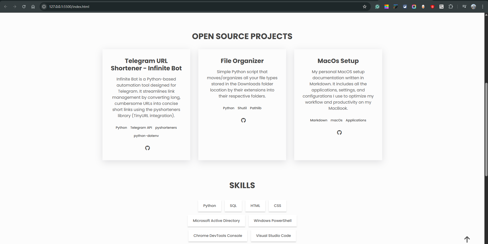

# Personal Portfolio

This repository contains the source code for my personal portfolio website. The site is designed to be a clean, minimal, and professional showcase of my journey using the Cleanfolio Minimal template.

## 🚀 Features

Responsive Design: Fully optimized for mobile, tablet, and desktop viewing.

Theme Toggle: Built-in Dark and Light mode functionality.

Project Showcase: Highlights open-source Python automation tools and documentation projects.

Skill Matrix: A categorized list of technical proficiencies from technical support to development.

TryHackMe Integration: Displays completed cybersecurity challenges and badges.

## 🛠️ Tools used

HTML5: Semantic structure for accessibility and SEO.

CSS3: Custom styling with a focus on a "Cleanfolio" minimal aesthetic.

JavaScript: Logic for the theme switcher and navigation menu.

FontAwesome: High-quality icons for social links and technical skills.

Google Fonts: Utilizing 'Poppins' for a modern, clean typography.

## Preview

()]

## Attribution

This portfolio is based on the Cleanfolio template, customized to reflect my specific professional background in the HRS industry and my transition into Python-based automation.

## License

[MIT](https://choosealicense.com/licenses/mit/)
